# FREEDOM-GAMING-ECOMMERCE-APPLICATION-FRONTEND :star_struck: 

[](https://shields.io/) [](https://shields.io/) [](https://shields.io/) [](https://shields.io/) [](https://shields.io/) [](https://shields.io/) [](https://shields.io/) [](https://shields.io/) [](https://shields.io/) [](https://shields.io/) [](https://shields.io/) [](https://shields.io/) [](https://shields.io/) [](https://shields.io/) [](https://shields.io/) 

***This new e-commerce application named 'FREEDOM GAMING' is created by Biswarup Bhattacharjee, student of BTECH, in University of Engineering and Management, Kolkata.***

**Email Id: bbiswa471@gmail.com.** 

**Contact No: 916290272740.** 

<p align="left">
<a href="https://www.facebook.com/profile.php?id=100070395300810" target="blank"></a>
<a href="https://instagram.com/biswarup2210" target="blank"></a>
<a href="https://github.com/biswa2210/biswa2210" target="blank"></a>
</p>

## About :point_down: 

<div align="justified">
       
This is an e-commerce electronics and gaming items shopping application for android and ios. Its a ecommerce application using react native. React Native (also known as RN) is a popular JavaScript-based mobile app framework that allows you to build natively-rendered mobile apps for iOS and Android. Here is register or login option when user opens for the first time. Here user has to register for the first time using email id, phone number, username and password. After the firt time user has to login with email id and password. Here is also a sigh out option for security purpose. In this shopping app there is a search engine where user can search products by name, company or categories. These search engine is made for making it user-friendly. Here are total 26 categories and 251 products in specific quantities. We can check products by choosing different categories. In each product there is a slider of images of that product and detailed description of that product including quantity, company name, availability status, price. Here is an Add button to add that product in cart. In the cart we can find tha product. Later we can easily order that item. There are two buttons here. Clear button is used for clearing the cart. If we want to order that product we have to proceed with Checkout button. There are 3 steps for ordering SHIPPING, PAYMENT and CONFIRM. In the Shipping Address part we have to give proper phone number, shipping address 1 and 2, city and a zip code for security. Here is also a drop down menu for choosing the country name. In the next part we can choose payment method among Cash on Delivery, Bank Transfer and Card Payment. After that we can proceed with CONFIRM button. In the final step we can place order. We can see our order in account section. Here we can see all detrails regarding our order. We can check the status of that order. For admin users there are additionl options. In the settings option user can use dd products option to dd poduct in ny ctegories. Here user has to write brand, name, price, count in stock, description for that product. User can also use camera to take images of that product from phone's internal storage. In the dd categories button user can add categoies by giving names. Here user can also delete an existing category. In the orders section user can see all orders of daily deals and also will be able to change the status of that order. Here user can choose among pending, shipped, delivered and update the status. This is a user-friendly android e-commerce shopping application.
       
</div>

## Backend Link :point_right: 
https://freedom-gaming-ipa.herokuapp.com/api/v1/

## Github Link of Backend :point_right: 
https://github.com/biswa2210/FreedomGaming-Backend

## Points about this app :point_down:

 - [x] 'Safe'<br>
 - [x] 'User-friendly'<br>
 - [x] 'Can be implemented for start up or business purpose'<br>
 
## Main things in this app :point_down:

 - [x] 'Categories'<br>
 - [x] 'Products'<br>
 - [x] 'Orders'<br>
       
## APP DOWNLOAD LINK : :point_right: <a href="https://drive.google.com/file/d/1F91JgwaQmm6BjiWpNn2dBl-h8HRl6icx/view" download>Click here to download</a>

## Purpose :point_down:

<div align="justified">
       
I have made this e-commerce android or ios application which is a shopping application named FREEDOM GAMING so that it can be used in any start up or business purpose. This app is very user-friendly so that anyone can search products and order them. This app has login system so that it is also dafe. In present days the need of mobile app for any business is growing day by day. Keeping the trend of using e-commerce app in mind and practicing to make a safe, efficient, user-friendly app I have made this app.In this day and age, almost everyone owns a mobile device with internet connectivity. They are used to shopping using their phones. They love to do that from anywhere- at the convenience of their homes or while they are on a train or in a cab on the way to work. Having a dedicated mobile app makes it easier for the consumer to find what they are looking for at a faster pace. This would mean increased customer satisfaction. A large number of consumers find it easier to shop using a dedicated mobile app than using a website. The quality of the experience, speed, and the ease at which the transactions can be made are a few reasons. A mobile app would always provide an optimized user experience.

</div>      
       
## Importance :point_down:

<div align="justified">
       
Ecommerce is usually an extension of a brick and mortar store that performs business transactions online. With the advancements in technology, more and more people have access to the internet and mobile phones are the most commonly used devices to access the same. With this rise in the internet audience, ecommerce businesses have shaped the online shopping behaviour. In that context, mobile ecommerce is gaining a lot more momentum. The convenience that mobile ecommerce offers by letting you shop for anything, anywhere, is one of the primary factors that attracts users. This is where a dedicated mobile application comes into the picture. Everyone has a mobile device glued to their hands and they seem to be an integral part of people’s lives. They use it to browse for information, read the news, keep track of their day to day events, and even shop. For a business owner, this is a place to invest in. They have to understand the significance of these devices in a consumer’s day-to-day lives. It has reached a stage that it is not enough to have an ecommerce website running. For that ecommerce store to reach its full potential, it has become essential to have a dedicated mobile app. It is predicted that by 2021, sales through mobile devices would hit $3.5 trillion. This is 72.9% of total ecommerce. So to stay relevant and to stay in the game, it is important for an ecommerce brand to build its dedicated mobile application.
</div>

## Folder Structure :point_down:

```bash
Screens
   ├── admin
   |     ├── categories.js
   |     ├── listItem.js
   |     ├── Orders.js
   |     ├── ProductForm.js
   |     └── Products.js
   ├── Screens
   |     ├── CHECKOUT_OF_OD
   |     |      ├── CheckoutforDD.js
   |     |      ├── Confirm.js
   |     |      └── PaymentForDD.js
   |     ├── Cart.js
   |     └── CartItem.js
   ├── Products
   |     ├── CategoryFilter.js
   |     ├── ProductCard.js
   |     ├── ProductContainer.js
   |     ├── ProductList.js
   |     ├── SearchedProducts.js
   |     └── SingleProduct.js
   └── user
         ├── login.js
         ├── Register.js
         └── SingleProfile.js
```                      
This part is created with javascript for different screens.
```bash
Navigators
    ├── AdminNavigator.js
    ├── CheckoutNavigator.js
    ├── HomeNavigator.js
    ├── CastNavigator.js
    └── userStackNavigator.js
```
This part is created with javascript for navigations.
```bash
ContextApi
   ├── Actions
   |     └── Auth.actions.js
   ├── Reducers
   |     └── Auth.reducer.js
   └── Store
         ├── Auth.js
         └── AuthGlobal.js  
```
This part is created with javascript for authentication.
```bash
ReduxDev
   ├── Actions
   |     └── CartActionsForDD.js
   ├── ReducersForDD
   |     └── CartItem.js
   ├── StoreForDD
   └── Constants.js
```
<a href="pics/Redux.gif"></a>
```bash
Shared
   ├── Form
   |     ├── FormContainer.js
   |     └── Input.js
   ├── StyledComponents
   |     ├── EasyButton.js
   |     └── Trafficlight.js
   ├── Banner.js
   ├── CartIcon.js
   ├── Error.js
   ├── Header.js
   └── OrderCardDD.js
```
This part is created with javascript for different styles.
```bash
assets
   ├── Common
   |     ├── baseUrl.js
   |     └── is-empty.js
   └── images for icons
```
This part is created with javascript for baseURl and empty.

## Making :point_down:

<div align="justified">

I have made an API and used that to work with this app's backend. I have made [freedom-gaming-server](https://freedom-gaming-ipa.herokuapp.com/api/v1/). The backend part is described in my another repository [freedom-gaming-server-biswa2210](https://github.com/biswa2210/FreedomGaming-Backend).
  
</div>

## Screenshots :point_down: 

<div align="center">
       
For non-admin or ordinary users
       
<a href="pics/d0.jpeg">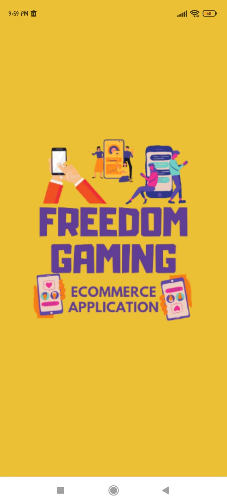</a> <a href="pics/d1.jpeg">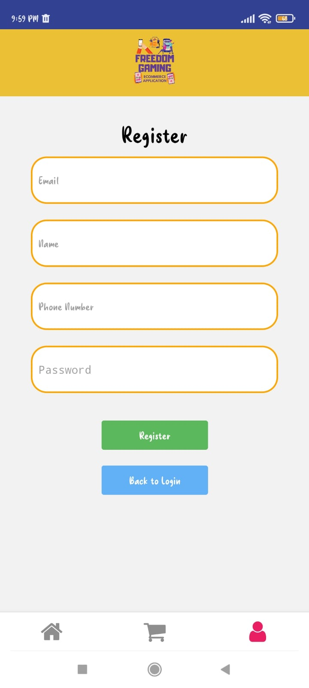</a> <a href="pics/d2.jpeg">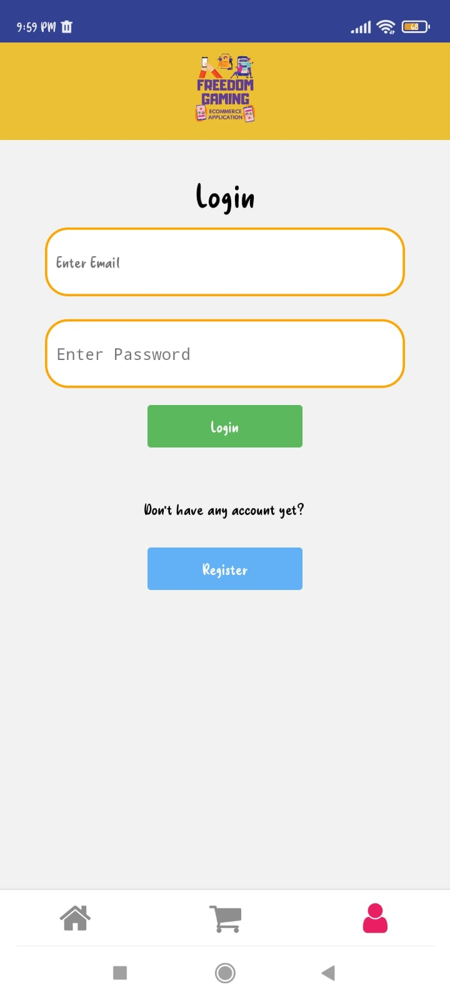</a>
       
<a href="pics/d3.jpeg">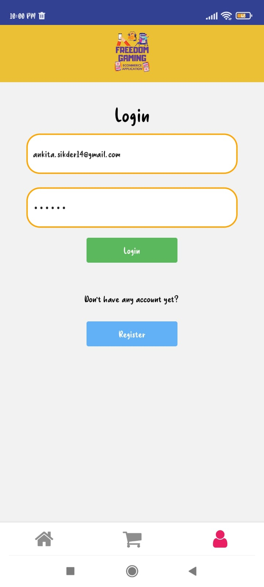</a> <a href="pics/d4.jpeg">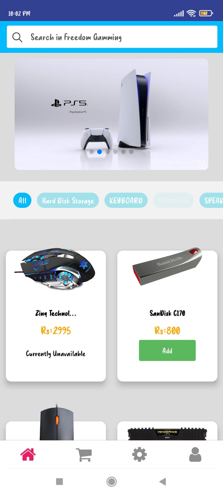</a> <a href="pics/d5.jpeg">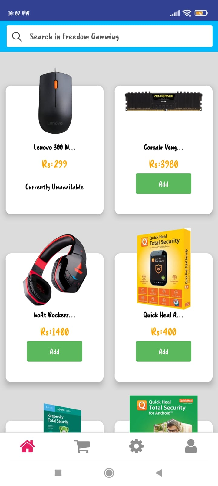</a>
       
<a href="pics/d6.jpeg">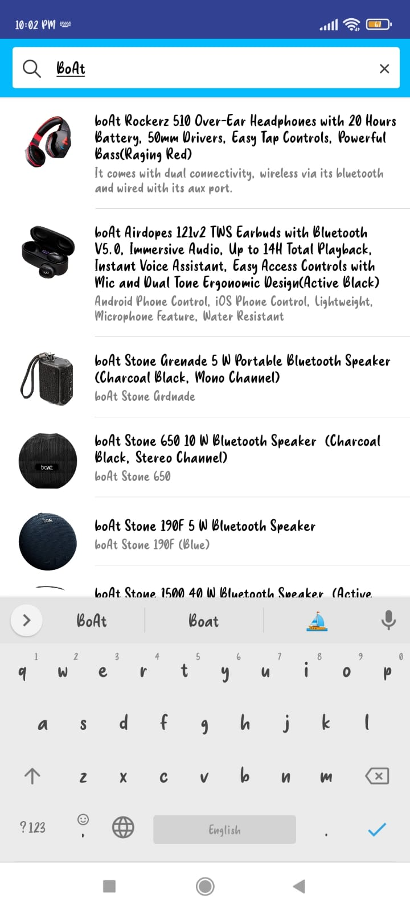</a> <a href="pics/d7.jpeg">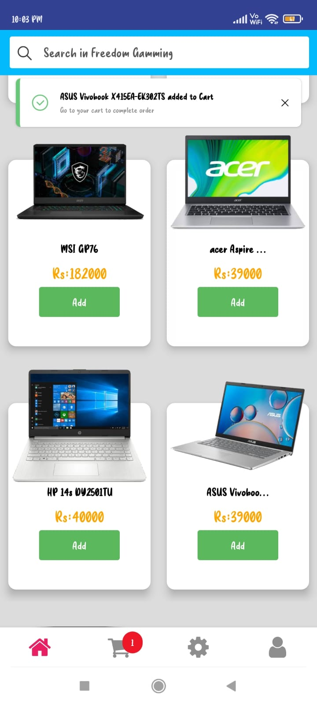</a> <a href="pics/d8.jpeg">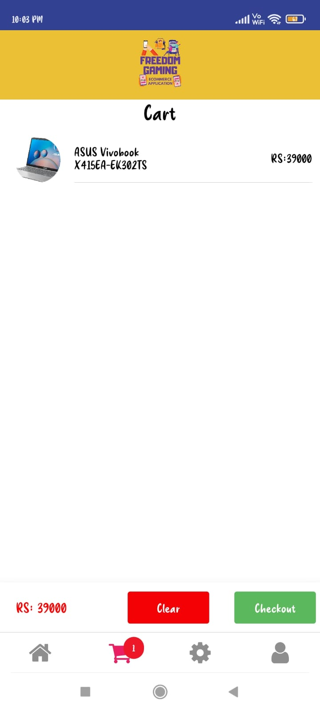</a>
       
<a href="pics/d9.jpeg">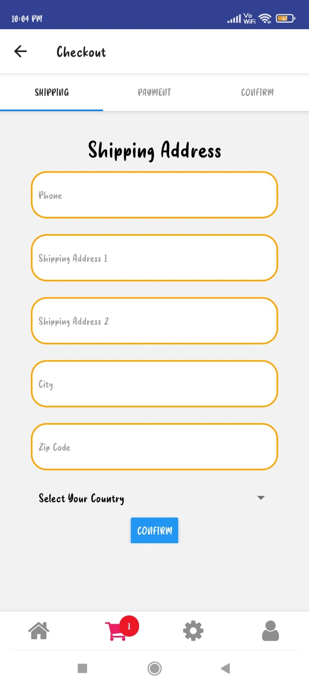</a> <a href="pics/d10.jpeg">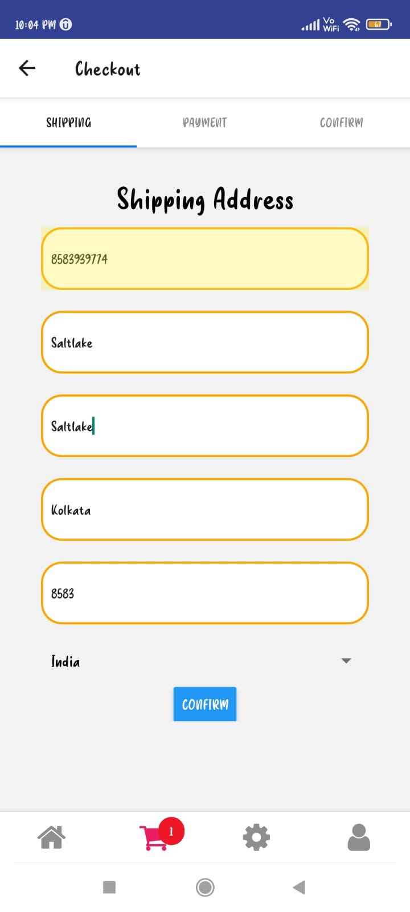</a> <a href="pics/d11.jpeg">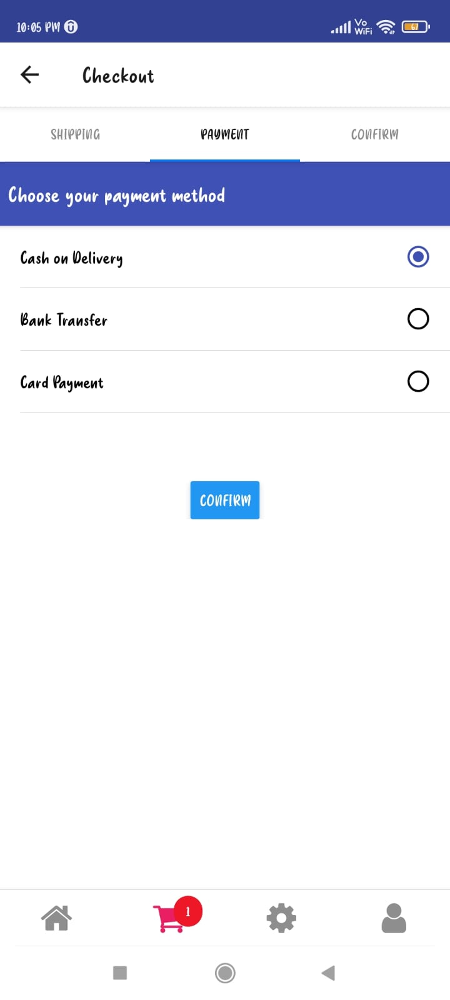</a>
       
For admin users this following part is additional       
       
<a href="pics/d12.jpeg">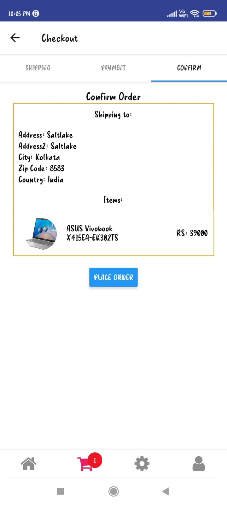</a> <a href="pics/d13.jpeg">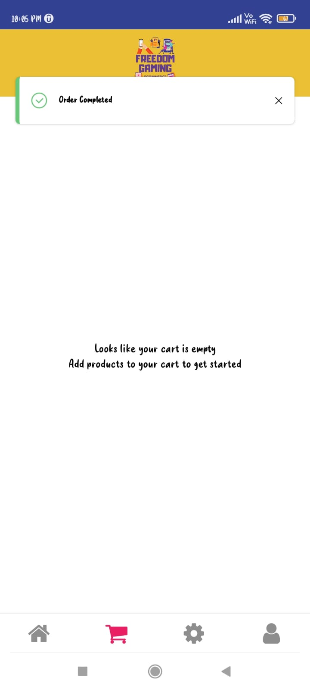</a> <a href="pics/d14.jpeg">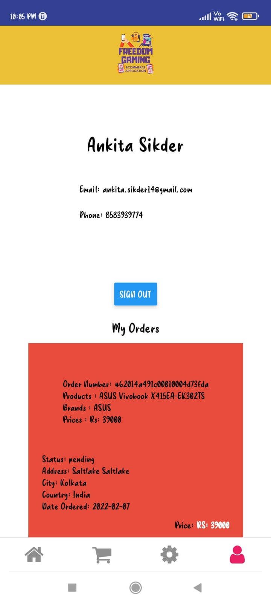</a>
     
<a href="pics/d15.jpeg">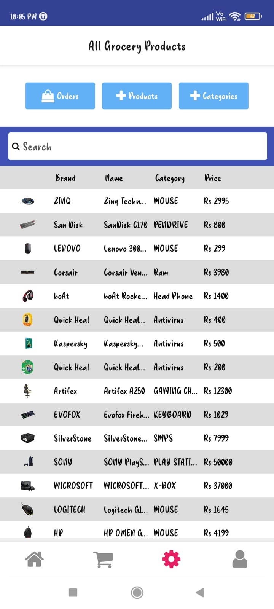</a> <a href="pics/d16.jpeg">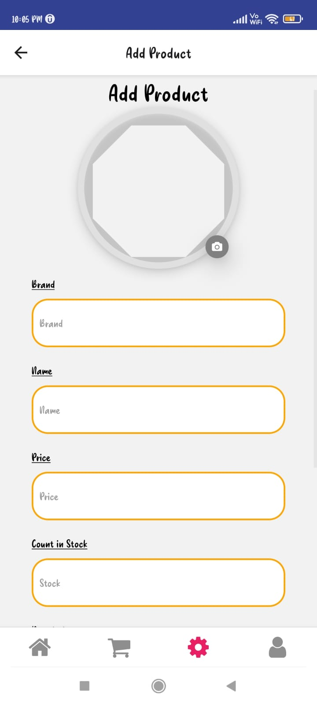</a> <a href="pics/d17.jpeg">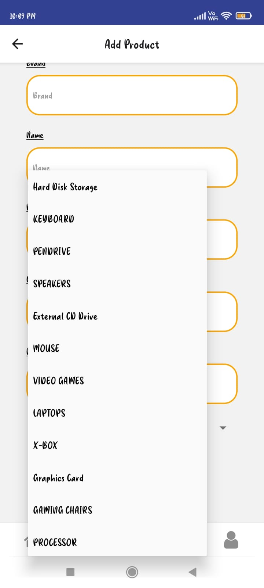</a>
       
<a href="pics/d18.jpeg">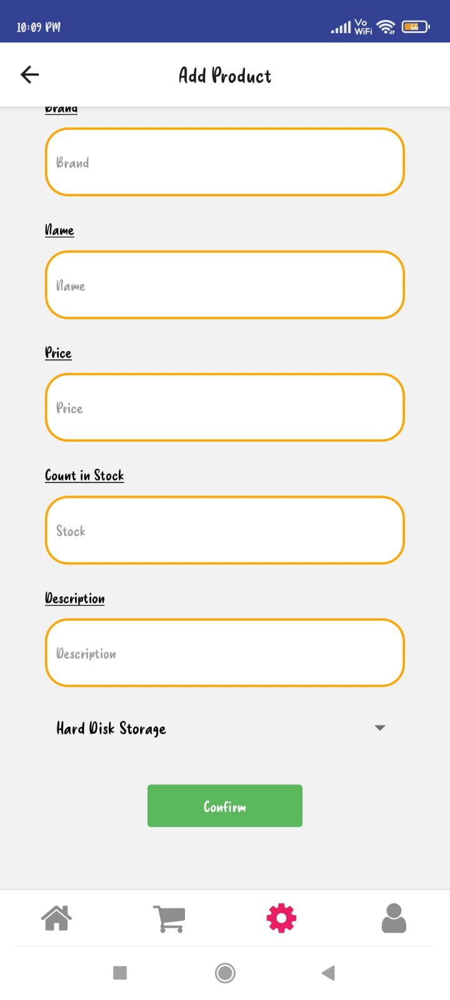</a> <a href="pics/d19.jpeg">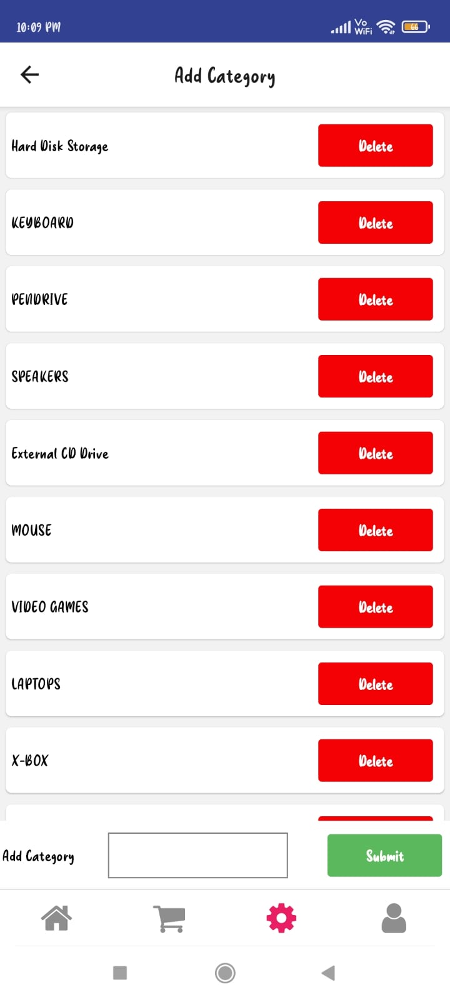</a> <a href="pics/d20.jpeg"></a>
  
<a href="pics/d21.jpeg"></a> <a href="pics/d22.jpeg">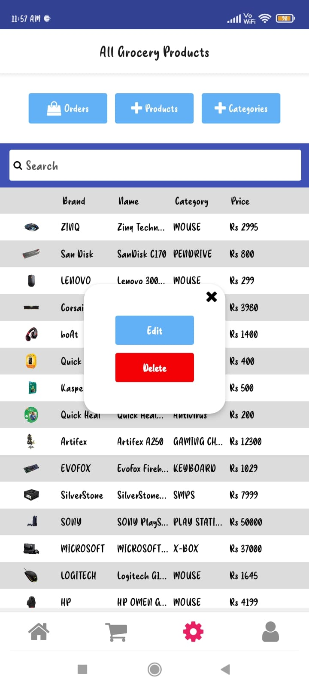</a> <a href="pics/d23.jpeg">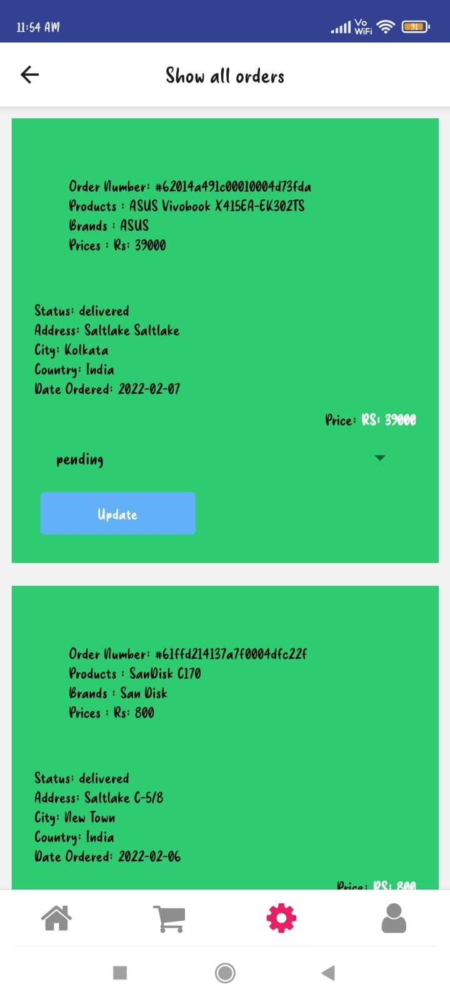</a>
</div>


